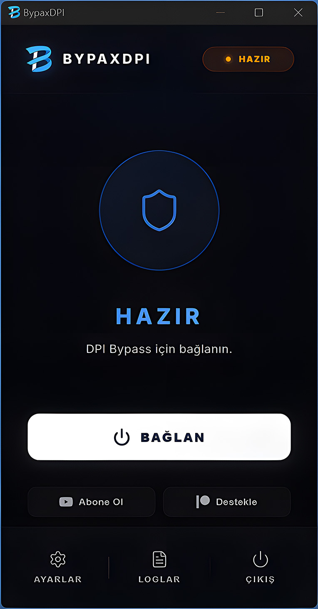
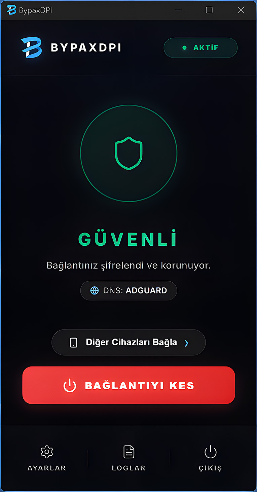
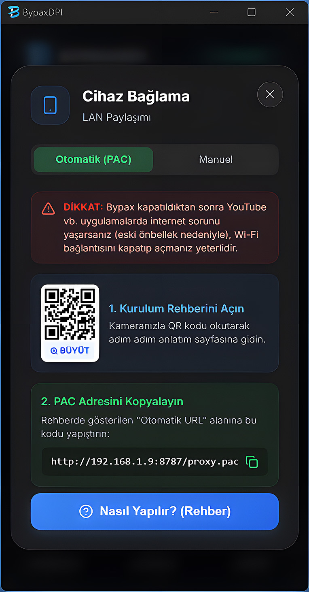

  

<h1 align="center">BypaxDPI</h1>

  <b>Discord ve internet erişim engellerini aşmak için tasarlanmış; askeri düzeyde çökmeye karşı dayanıklı (Anti-Crash), modern ve çok yönlü Yerel Proxy & DPI Bypass aracı.</b>

---

---

# 🚀 BypaxDPI v1.0.0 (Enterprise-Ready)

> **Discord ve internet erişim engellerini aşmak için tasarlanmış; askeri düzeyde çökmeye karşı dayanıklı (Anti-Crash), modern ve çok yönlü Yerel Proxy & DPI Bypass aracı.**

---

## 📸 Ekran Görüntüleri

  
  

---

## 📋 İçindekiler

- [Neden BypaxDPI? (Farkımız Ne?)](#-neden-bypaxdpi-farkımız-ne)
- [Özellikler](#-özellikler)
- [3 Kademeli DPI Bypass Motoru](#-3-kademeli-dpi-bypass-motoru)
- [Siber Güvenlik ve Kurumsal Standartlar](#-siber-güvenlik-ve-kurumsal-standartlar-enterprise-grade)
- [Sistem Gereksinimleri](#-sistem-gereksinimleri)
- [Nasıl Çalışır?](#-nasıl-çalışır)
- [Geliştirici & Destek](#-geliştirici--destek)
- [Gizlilik Politikası (Sıfır Log)](#-gizlilik-ve-telemetri-sıfır-log)

---

## 💡 Neden BypaxDPI? (Farkımız Ne?)

Piyasadaki diğer CMD/Java tabanlı (GoodbyeDPI, GreenTunnel vs.) kısıtlama aşıcı araçların en büyük sorunu **mavi ekran (BSOD) veya elektrik kesintisi gibi ani çökme durumlarında sistem proxy ayarlarınızı havada bırakarak internetinizi kırmasıdır.** 

BypaxDPI, baştan aşağı Rust (Tauri v2) altyapısıyla kodlanmış olup **Zombi Process Avcısı, Sentinel Recovery (Hata Kurtarma Sistemi)** ve **Kurumsal Proxy Yedekleme** (Backup & Restore) yetenekleriyle donatılmıştır. Bağlantınız ne şekilde koparsa kopsun, internetiniz daima güvendedir ve eski haline kendi kendini otomatik onarır!

---

## ✨ Özellikler

- **Sistem Geneli Akıllı Proxy**: Windows sistem proxy ayarlarını otomatik yönetir, böylece Discord,Roblox ve tarayıcılar ve diğer uygulamalar internet sansürünü tamamen aşar.

<table>
  <tr>
    <td width="35%" align="center">
      
    </td>
    <td width="50%" valign="middle">
      <b>📱 LAN Paylaşımı (WiFi ile Tüm Eve Dağıtım)</b>  
      Kendi içindeki Asenkron Limitli PAC Sunucusu sayesinde, bilgisayarınız üzerinden telefon, tablet veya konsolunuzu engelsiz ağa bağlayabilirsiniz.  
      <i>Ağ Ayarları ➔ Proxy ➔ Otomatik URL girerek veya <b>QR Kod okutarak</b> anında bağlanın.</i>
    </td>
  </tr>
</table>

- **DoH (DNS over HTTPS) Şifrelemesi**: ISP'lerin standart Port 53 DNS sorgularını avlamasını önlemek için Cloudflare, Google, AdGuard, Quad9, OpenDNS üzerinden trafiklerinizi Web (HTTPS) katmanında maskeler.
- **Canlı Soft-Restart (DPI Yenileme)**: Eski uygulamalar gibi DNS/Ayar değiştirdiğinizde uygulamayı söküp takmanız gerekmez. BypaxDPI canlı olarak yumuşak restart (Soft-Restart) atarak bağlantıyı yeni DNS protokolüne taşır.
- **Modern Fluent Arayüz**: Eski çağ siyah konsolların aksine; BypaxDPI Windows 11 Fluent UI kurallarına göre tasarlanmış React/Tailwind bir arayüz, Canlı Log Monitörü ve Çoklu Dil desteğine sahiptir.
- **Sistem Tepsisi (Tray) Zulası**: Tek tıklamayla bildirim çubuğunda sessize geçer (Single-Instance Mimari). Birden fazla uygulamayı yanlışlıkla açıp işletim sisteminizi kilitlemeniz (Race-Condition) engellenmiştir.

---

## ⚙ 3 Kademeli DPI Bypass Motoru

Güncellenmiş BypaxDPI sürümü, internet servis sağlayıcınızın (ISP) dayattığı zorluk derecesine göre anında geçiş yapabileceğiniz 3 farklı bypass motoru sunar:

| Mod | İsim | Özellikler (Alt Taraf: Go Engine) |
| :---: | :--- | :--- |
| **0** | **Turbo Mod** | Sadece SNI ayrıştırması uygular. En agresif hız modudur, oyundaki ping'leri (gecikmeleri) asla etkilemez. |
| **1** | **Dengeli Mod** | HTTPS TLS paketlerini Chunk Split (parçalama) yöntemiyle böler ama sıralarını bozmaz. Türkiye'deki çoğu standart kısıtlamayı (Discord vb.) direkt aşar. |
| **2** | **Güçlü Mod** | Paketleri hem küçük parçalara böler (Chunk) hem de ISP'nin paket takip sırasını bozar (Disorder). Aşılması en zor katı DNS kapılarında tercih edilir. |

*Gelişim menüsünde, 4/8/16 bayt'lık ince ayar Chunk Size opsiyonları bulunur.*

---

## 🛡️ Siber Güvenlik ve Kurumsal Standartlar (Enterprise-Grade)

BypaxDPI, kod düzeyindedir ve tamamen "0 Zafiyet" denetiminden (Security Audit) geçmiş profesyonel bir mimari kullanır:

1. **Dirty-State Sentinel Recovery:** Uygulama veya PC aniden fişten çekilir/çökerse (BSOD), başlangıca koyduğumuz Sentinel mekanizması geriye çöp kalıp kalmadığını denetler ve bağlantınızı kalıcı olarak temizler (İnternetsiz kalmazsınız).
2. **Original Proxy Backup:** Eğer zaten işyerinizin/şirketinizin kendine ait bir Proxy ayarı kuruluysa, BypaxDPI bunu çalışmadan önce güvenle yedeğe alır; işi bittiğinde proxy ayarlarınızı eski kurumsal haline "Restore" eder.
3. **Rust Native WinAPI:** CMD/Powershell gibi hantal ve güvenlik uyarısı tetikleyen arka plan yazılımları tamamen kaldırılmıştır; onun yerine Yönetici yetkisi, Registry okumaları Rust'ın kendi Native `windows` crate'i ile 1ms altında güvenceyle yürütülür.
4. **Thread-Rate Limitli PAC Sunucusu:** Açık WiFi veya ofiste aynı ağdaki yabancı cihazların PAC portunuza göndererek bellek sızdırmasını (DDoS) engellemek adına Asenkron Bağlantı Limiti (Maksimum 50) eklidir. 
5. **Anti-XSS ve Strict-Scope (RCE Engeli):** Arayüzden gelebilecek tüm Zararlı kod (CSS/JS) ihtimalleri, sıkı `DOMPurify` süzgecinden geçirilir ve Tauri'nin işletim sistemi tetikleme (Shell) yetkileri "Yalnızca Kendi Core'unu" çalıştırabilecek şekilde izole edilmiştir.

---

## 💻 Sistem Gereksinimleri

- **İşletim Sistemi**: Windows 10 veya Windows 11
- **Mimari**: x64 İşlemci (RAM kullanımı inanılmaz düşüktür; WebView2 sayesinde genelde ~60 MB)
- **Yetki**: Proxy yönetimi bazı yerel network ayarlarında UAC (Yönetici İzni) gerektireceğinden uygulama "Yönetici" olarak çalışmayı tavsiye edebilir.

---

## 🔧 Nasıl Çalışır? (Kurulum)

1. **İndirin**: Projenin [Releases sayfası](https://github.com/BypaxDPI/BypaxDPI-Windows/releases) bağlantısına gidip en güncel versiyonun `.exe / .msi` dosyasını bilgisayarınıza indirin.
2. **Kurun**: Uygulamayı çalıştırın. Kendi yerleşik (gömülü) motorunu kullanacağı için WinPcap vb. hiçbir ek program / sürücü yüklemenize **asla** gerek yoktur.
3. **Açın ve Tıklayın**: İsterseniz Ayarlar (Dişli İkonu) sekmesinden *DoH DNS*, *Güçlü Mod* ve *LAN Paylaşımı (Telefon)* özelliklerini zevkinize göre açıp; ana ekrandaki **BAĞLAN** tuşuna dokunmanız yeterlidir. Ekranda **Güvenli** yazdığı an Discord ve ötesindeki dünyaya aitsiniz.

---

## 🤝 Geliştirici & Destek

Bu proje açık kaynaklı, tamamen hür bir topluluk girişimidir. BypaxDPI'ın yaşaması, donanımlarının güncellenmesi için bana kahve ısmarlamak isterseniz:

- **GitHub Sponsor:** 
- **Patreon:** 

**Geliştirici:** Crafted with 💖 & Rust by [ConsolAktif](https://github.com/MuratGuelr)

---

## 🔒 Gizlilik ve Telemetri (Sıfır Log)

> [!IMPORTANT]
> BypaxDPI %100 Anonimdir ve **HERHANGİ BİR TELEMETRİ VEYA VERİ TOPLAMA YAPISI BARINDIRMAZ.** 
> Hiçbir IP adresiniz, girdiğiniz internet siteleri (URL'ler), işletim sistemi bilgileriniz ne bir sunucuya ne de bize asla gönderilmez. Uygulama logları RAM'de (geçici hafızada) işlenir; program kapatıldığı saniye kainattan silinir. 

---

## ⚖️ Sorumluluk Reddi

- **Bu yazılım yerel ağ problemleri eğitimi, soket debugging ve erişilebilirlik laboratuvarı (Bypass algoritmalarını simüle etme) amaçlı yazılmıştır.**
- BypaxDPI yalnızca local makinenizde giden HTTPS trafiğinin TLS paketlerini (SNI katmanı) bölerek yeniden organize eder (Packet Fragmentation). Herhangi bir uzak VPN sunucusu ile veri alışverişi (Şifre çözücü tünel) sağlamaz, bu yüzden bankacılık dahil tüm işlemleriniz ISP/Browser ile kendi aranızdadır.
- Yazılım kişisel kullanıma açık ve ücretsizdir; ticari, yasadışı ya da manipülatif amaçlı siber ihlaller hedefinde kullanılamaz. BypaxDPI ile gerçekleştirilen tüm erişim faaliyetleri ve oluşacak teknik/yasal yükümlülükler tamamen son kullanıcıya (kullanıcıya) aittir. Üretici kanun yolları için sorumluluk reddinde bulunur. 

 

  <strong>🔥 BypaxDPI ile kesintisiz ve şeffaf internete hoş geldiniz!</strong>

